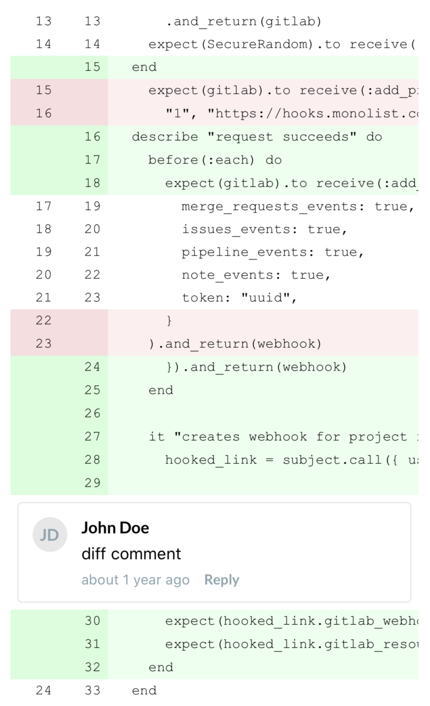

# react-native-diff-view [](https://travis-ci.org/jakemmarsh/react-native-diff-view) 

A React Native module for parsing and displaying git diffs. This library was heavily inspired by, and borrows code from, [react-diff-view](https://github.com/otakustay/react-diff-view).

## Overview

The purpose of this library is to parse and render a unified diff view for any provided diff(s). The flexible widget system also allows for rendering of custom elements on a per-line (or "change") basis. The end result will look something like this:



## Getting Started

`npm install --save react-native-diff-view`

## Usage

### Parsing Diffs

The top-level `parseDiff(diff: string): IFile[]` export is a wrapper around [gitdiff-parser](https://www.npmjs.com/package/gitdiff-parser), but strongly typed
and with some extra options:

- `nearbySequence: 'zip' | undefined` &mdash; the action to take when nearby sequences are encountered.

### Rendering Diff Hunks

The top-level `Diff` export is a component to be used for rendering a single diff. Here's a simple example:

```tsx
import React from 'react';
import { View, ScrollView } from 'react-native';
import { parseDiff, Diff, Hunk } from 'react-native-diff-view';

const App = ({ diffText }) => {
    const files = parseDiff(diffText);

    const renderFile = ({ oldRevision, newRevision, type, hunks }) => (
      <ScrollView key={oldRevision + '-' + newRevision} horizontal={true} bounces={false}>
        <Diff diffType={type} hunks={hunks}>
            {(hunks) => hunks.map((hunk) => <Hunk key={hunk.content} hunk={hunk} />)}
        </Diff>
      </ScrollView>
    );

    return (
      <View>
        {files.map(renderFile)}
      </View>
    );
};
```

`props.children`, in this case, is a function that takes an array of `IHunk` and returns the rendered element(s). This is optional,
and if not provided the hunks will be rendered as default `<Hunk/ >` components.

### Wrapping Hunks in Decorations

A decoration is a way to wrap a `<Hunk />` component with customized content.

A `<Decoration />` component is a simple passthrough of `props.children`, which can be either a single element or an array of two:

- A single element: this will be rendered in the entire row.
- An array containing two elements: The first element will be rendered in gutter position, the second will be rendered in code position.

A very simple use case of `Decoration` is to provide a summary infomation of hunk:

```tsx
import React from 'react';
import { Diff, Hunk, Decoration } from 'react-native-diff-view';

const renderHunk = (hunk) => [
  <Decoration key={'decoration-' + hunk.content}>
      {hunk.content}
  </Decoration>,
  <Hunk key={'hunk-' + hunk.content}> hunk={hunk} />,
];

const DiffFile = ({ diffType, hunks }) => (
  <Diff diffType={diffType}>
      {hunks.map(renderHunk)}
  </Diff>
);
```

### Rendering Widgets

As mentioned above, widgets can be used to render custom element(s) on a per-change, or per-line, basis. These will be rendered
immediately below their corresponding line. Only the first match will be rendered.

Here's a basic example that adds a warning on long lines:

```tsx
import React from 'react';
import { Text } from 'react-native';
import { parseDiff, getChangeKey, Diff } from 'react-native-diff-view';

const getWidgets = (hunks) => {
    const changes = hunks.reduce((result, {changes}) => [...result, ...changes], []);
    const longLines = changes.filter(({content}) => content.length > 120);

    return longLines.reduce(
      (widgets, change) => {
        const changeKey = getChangeKey(change);

        return {
          ...widgets,
          [changeKey]: <Text>Line too long</Text>
        };
      },
      {},
    );
};

const App = ({diffText}) => {
    const files = parseDiff(diffText);

    return (
        <div>
            {files.map(({hunks}, i) => <Diff key={i} hunks={hunks} widgets={getWidgets(hunks)} viewType="split" />)}
        </div>
    );
};
```

### Styling

The following props are supported but optional on the top-level `<Diff />` component:

- `style: ViewStyle` &mdash; styling to be applied to the top-level `Diff` view.
- `lineStyle: ViewStyle` &mdash; styling to be applied on each individual change line.
- `gutterStyle: ViewStyle` &mdash; styling to be applied on the gutter of each individual change.
- `contentStyle: ViewStyle` &mdash; styling to be applied to the code content of each individual change.

### Events

The following events are supported but optional on the top-level `<Diff />` component:

- `onChangePress(change: IChange) => any` &mdash; if provided, this will be triggered any time a user presses on a specific
line or change in a diff.

## Contributing

🎊 Thanks for considering contributing! Issue reports and pull requests are always welcome.

To get started:

1. `git clone https://github.com/jakemmarsh/react-native-diff-view.git`
2. `cd react-native-diff-view`
3. `npm install`

To test your changes before opening a PR:

`npm test`
